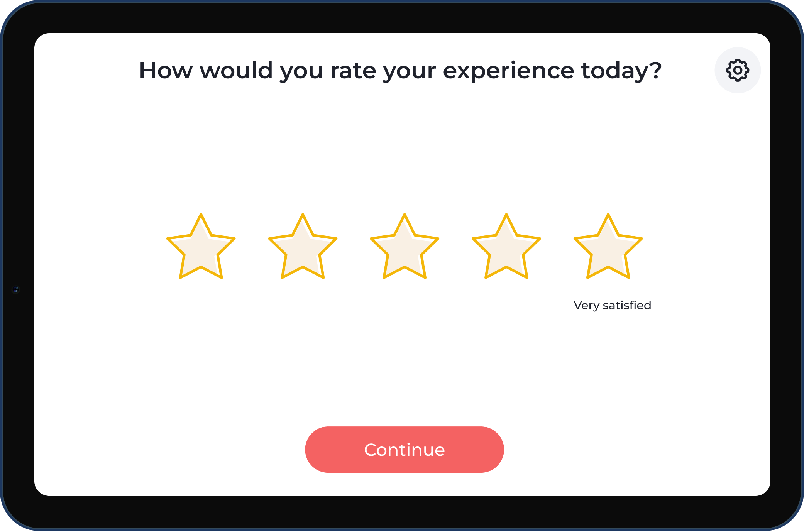
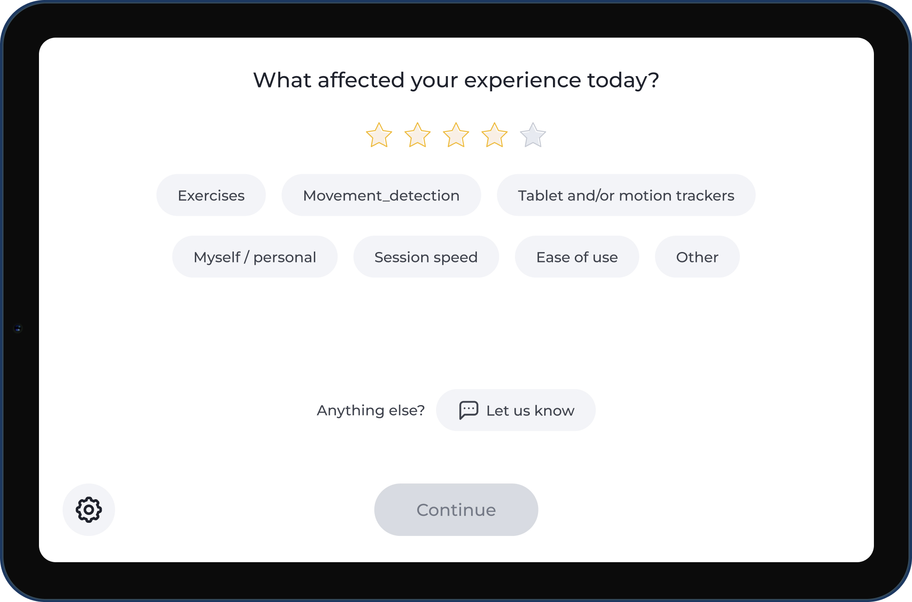
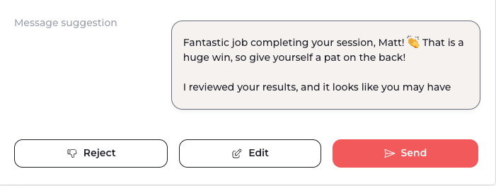
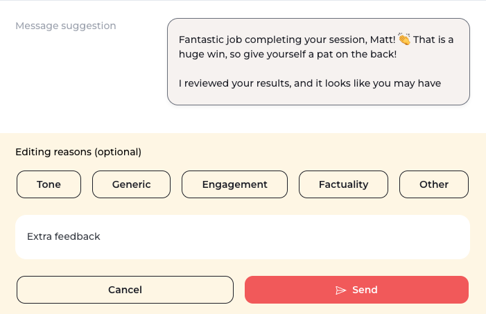
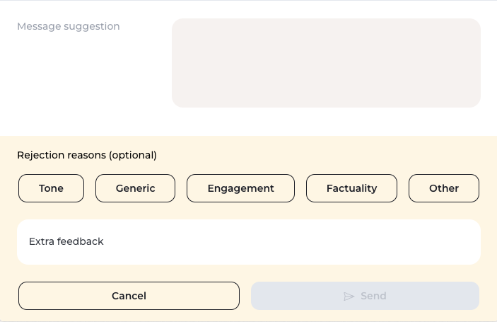

# ML Engineer Application Test

**This document as well as the accompanying data and code is confidential and thus should not be shared with anyone other than the applicant during or after the test.**

## General Instructions:

Before starting the challenge please follow these steps:

- Run `make venv` to set the virtual environment.

- If needed, request a valid `OPENAI_API_KEY` through email to the recruiter that sent you the challenge.

- Add the provided environment variable (`OPENAI_API_KEY`) to the .env file.

    > Please note that we closely restrict and monitor this endpoint for excessive or unintended usage and will immediately remove the candidate from the application process if we detect over or unintended usage.

- Extract the files in [data.zip](data.zip) (two files should be extracted: `exercise_results.parquet` and `features_expected.parquet`)

- Run the `starter.ipynb` notebook to make sure access to the GPT model is working as expected.

> Face this challenge as if you were developing this code in a real productization scenario and thus ensure it would pass a read code review process. Don't leave out anything necessary for a production-ready codebase.

## ⚔️ Context on Sword

Sword offers a plethora of solutions to predict, prevent and treat pain. 

Our [Digital Physical Therapy program (DPT)](https://swordhealth.com/solutions/digital-therapy) is one of the most sough after solutions to address different musculoskeletal pathologies. The Digital Therapist (DT) is a system consisting of a tablet which we ship to the patient’s home. By taking advantage of motion tracking and motion analysis algorithms the DT guides patients through a physical therapy session by providing human-like realtime feedback about their movement.

Each patient’s Physical Therapist (PT) has access to a web Portal for patient management. In this Portal, the therapist can analyze session results in an async fashion, adjust the exercise prescription, and communicate with the patient through a two-way chat system (via an app the patient can install on his smartphone).

## 💌 Context on the problem

In the absence of the connection established during in-person physical therapy sessions, most of the therapeutical bonding between patient and physical therapist is established via the chat in the Portal.
Besides replying to inbound messages, PTs proactively reach out to patients on a recurring basis to check in on them:  helping those that haven’t started, cheering on those doing sessions to keep the momentum going, trying to recover those on the verge of giving up, etc.

One of the moments PTs should check in on patients is after a session is performed.
Once a session is performed, a classification model scores each session as `ok` or `nok`.
This score and the session results are used by the PT to craft a highly personalized message.

The goal of the message is to:
- Acknowledge completion of the session
- Reinforce communication, consistency
- And ultimately, keep the patient engaged with the program

If the session is classified as `ok`:
- Cheer on the member and congratulate the good performance
- Collect member feedback on overall session
- Get member commitment to continue doing sessions
   
If the session is classified as `nok`:
- Downplay any tech or clinical issues 
- Member feedback on what went wrong
- Generate conversation between PT and member to problem solve

Some guidelines are shared with the PTs to ensure message quality:
- Do not repeat yourself.
- Keep the tone conversational and laid-back; avoid formal or clinical language.
- Be concise
- Be motivational and empathetic.
- *Do not* ask questions in the middle of the message. Conclude with a *single* open-ended question.
- Do not include a formal goodbye.
- Avoid empty sentences.
- Use new lines to break down message into manageable pieces.

Bellow are examples of what good messages would look like:

For an `ok` session:

```
Fantastic job completing your session Matt!
I’m curious, how do you feel your first session went?
    
To kick-start your progress, I suggest a session every other day for the next two weeks.
How does this plan sound? Will that work for you?
```

For an `nok` session:
```
Fantastic job completing your session, Matt!
👏 That is a huge win, so give yourself a pat on the back!  

I reviewed your results, and it looks like you may have had a bit of trouble with the hip raise exercise. This can happen in the first session or two as the system gets used to the way you move.   

Can you tell me a little bit about what happened here? Was tech the issue on that one?
```

## Question 1

Throughout each session we collect data on every exercise performed. 

This data is available on a web portal and is used by the PT to craft a highly personalized message.

Each record of the collected data is stored in a table named `exercise_results` containing the following fields:

| Field                      | Meaning |
| :---                       | :---    |
| `session_exercise_result_id` | Identifier of an exercise performed by a patient in a given moment in time (primary key). Each time a patient performs the same exercise, even if in the same session, it will have a different `session_exercise_result_id`. |
| `session_group`              | Identifier of the physical therapy session in which this exercise was performed. Each time a patient performs a session it will have a different `session_group` (all exercises of the same session will have the same value). |
| `patient_id`              | Identifier of the patient that performed the session  (all sessions of the same patient will have the same value). |
| `patient_name`              | Name of the patient that performed the session (all sessions of the same patient will have the same value). |
| `patient_age`               | Age of the patient that performed the session (all sessions of the same patient will have the same value). |
| `exercise_name`              | Name of the performed exercise. |
| `exercise_side`              | Body side that the exercise regards. |
| `exercise_order`             | Order of the exercise within the session (the first exercise of the session has `order` 1, the second has `order` 2 and so on). |
| `prescribed_repeats`         | Number of repetitions (individual movements) the patient was supposed to perform in this specific exercise. Can be different among two performances of the same exercise in the same session. The exercise finishes when the number of performed repetitions - either correct or wrong - reaches this value. |
| `training_time`              | Time, in seconds, the patient spent performing the exercise |
| `correct_repeats`                         | Number of correct repetitions performed. |
| `wrong_repeats`              | Number of incorrect repetitions performed. |
| `leave_exercise`             | If the patient leaves the exercise before finishing it, this field stores the reason why. If the patient leaves the exercise, he is led into the following exercise in the session. |
| `leave_session`              | If the patient leaves the session before finishing it, this field stores the reason why (all exercises of the same session will have the same value). If the patient leaves the session, no more exercises are performed. |
| `pain`                       | Amount of pain between reported by the patient at the end of the session where this exercise was performed, between 0 and 10, where 0 is no pain and 10 is the worst possible pain (all exercises of the same session will have the same value). |
| `fatigue`                    | Amount of fatigue between reported by the patient at the end of the session where this exercise was performed, between 0 and 10, where 0 is no fatigue and 10 is the worst possible fatigue (all exercises of the same session will have the same value). |
| `therapy_name`               | Name of the therapy the patient is undertaking (the same for all exercises in the same session). |
| `session_number`               | Session number for that patient. The first session performed by the patient will have `session_number` equal to 1, the second 2, ... (the same for all exercises in the same session). |
| `quality`                    | Score from 1 to 5 reported by the patient at the end of the session when replying to the "How would you rate your experience today?" question (all exercises of the same session will have the same value).|
| `quality_reason_*`                  | Additional context collected when a quality bellow 5 is reported by the patient (see image bellow). Possible values are `movement_detection`, `my_self_personal`, `other`, `exercises`, `tablet`, `tablet_and_or_motion_trackers`, `easy_of_use`, `session_speed` (all exercises of the same session will have the same value). |
| `session_is_nok` | Classification model score on each session (1 corresponds to a `nok` session and 0 to an `ok` session). |

||  |
| :---: | :---: |
| Quality question asked at the end of the session. | Available quality reasons when a quality bellow 5 is selected. |

Transform the above data such that each row is indexed by `session_group` (thereby representing a performed session instead of a performed exercise) and has the following fields: 

| Field                           | Meaning |
| :---                            | :---    |
| `session_group`                 | explained above (primary key) |
| `patient_id`                    | explained above |
| `patient_name`                  | explained above |
| `patient_age`                   | explained above |
| `pain`                          | explained above |
| `fatigue`                       | explained above |
| `therapy_name`                  | explained above |
| `session_number`                | explained above |
| `leave_session`                 | explained above |
| `quality`                       | explained above |
| `quality_reason_*`              | explained above |
| `session_is_nok`                | explained above |
| `leave_exercise_*`           | Number of exercises in the session that were left due to reason `system_problem`, `other`, `unable_perform`, `pain` and `tired`, `technical_issues`, `difficulty` respectively. |
| `prescribed_repeats`            | Total number of repetitions (among all exercises) the patient was supposed to perform. |
| `training_time`                 | Time, in seconds, the patient spent performing the session. |
| `perc_correct_repeats`                       | Percentage of correct repetitions in the session. |
| `number_exercises`                | Number of exercises performed in the session. |  
| `number_of_distinct_exercises`    | Number of distinct exercises performed in the session. |

**Bonus points:** include also the following fields:

| Field                           | Meaning |
| :---                            | :---    |
| `exercise_with_most_incorrect`  | Name of the exercise with the highest number of incorrect movements, if any. If there are two with the highest number of incorrect movement, you can pick any of them. |
| `first_exercise_skipped`        | Name of the first skipped exercise, if any. |

### Instructions:

- The transformation should be done using SQL or Python.
    - If using SQL, the query should be added to the `queries/features.sql` file.
    - If using Python, the code should be added to the `transform_features_py` function available on `message/data.py` (you can structure your code as you see fit but please keep the `transform_features_py` function as the high level function)
- Adjust the `transform` function on `messages/main.py` according to your choice of SQL or Python
- To run the transformation you can use `make transform`.
- Please do not change the `open_query`, `transform_features_sql` and `get_features` functions provided on `messages/data.py`.
- To test your code, you can use `exercise_results.parquet` and `features_expected.parquet` as the input and output, respectively.

## Question 2

Currently PTs manually draft the message to be sent based on the session context and the guidelines provided above.

To reduce the time PTs spend writing a message and to guarantee a high standard of quality for every sent message, after each performed session an AI-generated message should be suggested to the PT.

This message is sent by the PT so patients should not get the feeling this message was AI-generated.

The PT can then accept, edit or reject the message as shown bellow.

|  |  |  |
| :---: | :---: | :---: |
| Accept message. | Edit message. | Reject message. |

#### Goal

Create an application that supports the aforementioned use case, taking advantage of the provided starter code and given the context about the goals of PT messaging shared above.

#### Instructions:

1. **Model Integration and Usage:**

    - Utilize the models provided by OpenAI  (see [here](https://platform.openai.com/docs/models/overview) for a detailed list).

    - Leverage the [`ChatModel`](message/model.py) object as demonstrated below:

```python
from message.model import ChatModel, OpenAIKeys
from message.config import get_settings

settings = get_settings()

chat_model = ChatModel()

message = chat_model.get_completion(
    temperature=0,
    model="gpt-4-turbo-preview",
    messages=[
        {OpenAIKeys.ROLE: "system", OpenAIKeys.CONTENT: "You are a helpful assistant"},
        {OpenAIKeys.ROLE: "user", OpenAIKeys.CONTENT: "Hello!"},
    ],
)
```

2. **Functional Requirements:**

    - Complete the `get_message` function in the `message/main.py` file.

    - Ensure that the generated messages align with the use case, are contextually appropriate for each patient and of high quality.

    - Creating a user interface is out-of-scope.

3. **Code Structure and Organization:**

    - Organize your code logically, potentially taking advantage of additional functions if deemed appropriate.

    - Make your code clean, easy to read and maintain.

4. **Comments and Documentation:**

    - Provide clear reasoning, considerations, and conclusions through comments or documentation.

    - Highlight any assumptions or design decisions you make during implementation.

5. **Future Considerations:**

    - Include potential next steps you would follow if you had more time to work on this problem.
    - Think about scalability, additional features, and potential improvements.

    